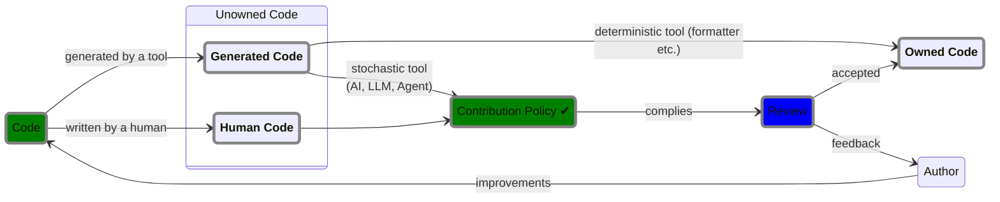

# Contribution Guidelines

:tada: **First off, thank you for considering contributing to our project!**
:tada:

<!--toc:start-->

- [Contribution Guidelines](#contribution-guidelines)
  - [🚀 Ways to Contribute](#🚀-ways-to-contribute)
  - [✅ Ground Rules](#ground-rules)
  - [Definitions](#definitions)
  - [Contribution Policy](#contribution-policy)
    - [Creating Owned Code](#creating-owned-code)
  - [Reviewing Policy](#reviewing-policy)
    - [Review Topics](#review-topics)
  - [🧑‍💻 Development Guide](#🧑‍💻-development-guide)
  <!--toc:end-->

## 🚀 Ways to Contribute

There are many ways to get involved:

- 🐛 Reporting bugs or inconsistencies
- 🎯 Proposing or implementing new features
- 📚 Improving documentation
- 🧪 Writing or improving tests
- 🧵 Reviewing and refining code
- 📣 Sharing feedback or joining discussions

Please [open an issue](https://github.com/sdsc-ordes/modos-rs/issues) or
[submit a pull request](https://github.com/sdsc-ordes/modos-rs/pulls) to get
started.

## ✅ Ground Rules

We aim to maintain a welcoming, diverse, and inclusive environment for everyone.

- Be respectful and constructive.
- Assume good intent.
- Collaborate openly and in good faith.
- Abide by our [Code of Conduct](docs/code-of-conduct.md).

## Definitions

- _Unowned Code_: Code not owned by any human.
- _Generated Code_: Code generated by a tool. _Generated Code_ is by definition
  _Unowned Code_.

  > [!NOTE]
  >
  > _Generated Code_ can become _Owned Code_ when going through the below code
  > contrib. policy.

- _Human Code_: Code written by a human. It is not yet _Owned Code_.
- _Owned Code_: Code owned by a human. It complies with the below
  [code contrib. policy](#contribution-policy).

## Contribution Policy

The **goal** of the code base is to have **as little _Unowned Code_ as
possible** and have clear disclosure where it exists.

### Creating Owned Code

For **all code** whether its _Unowned Code_ or _Generated Code_ (e.g. by a tool
of stochastic nature like `claude`, `gpt` etc.) or **human-written**, the author
MUST comply with the below rules **before any review** is conducted.

> [!NOTE]
>
> Deterministic code generation like language-server-protocol (LSP) refactoring
> or `protoc` or formatters are explicitly exempt from the below.

**The author**

- **MUST be able to explain all code to the API level boundary in the context**:
  The author understands the respective API of the library/module/package they
  are using and has read the corresponding original documentation (not only an
  AI-generated summary). This also applies to self-maintained libraries.

  > [!NOTE]
  >
  > If you can't explain what the code does and how it interacts with the
  > greater system, do not contribute to this project.

- **HAS contextualized & refactored the code to fit the surrounding scope**:
  This entails the normal process when writing _Human-Code_. This also means to
  have been familiarized with the types/function/modules which are in play.
  [See review topics](#review-topics).

Following these rules transforms code into _Owned Code_ which is ready for
review.

## Reviewing Policy

- The reviewer **only reviews _Owned Code_**, that is code which went through
  the [code contrib. policy](#contribution-policy). The reviewing process is
  described below.

- Reviewers feedback is fed solely into the **author's human brain** and
  addressed by themselves.

  > [!NOTE]
  >
  > Talking to a chatbot through a human proxy is not a productive use of our
  > collective work time.

### Review Topics

The following topics should be considered when reviewing code. The reviewer
should look out for:

- Subtle Bugs
- Wrong Assumptions
- Bad Abstractions
  - Is
    [Single-Layer-Of-Abstraction](https://www.principles-wiki.net/principles:single_level_of_abstraction)
    violated: "What the code achieves, does not fit well in the greater scope
    (function, class, module, package, etc.).
- Edge Cases
- Security Issues
- Integration Problems

## 🧑‍💻 Development Guide

For local setup instructions, style guidelines, and how to run tests or submit
PRs, see the [Development Guide](docs/development-guide.md).
