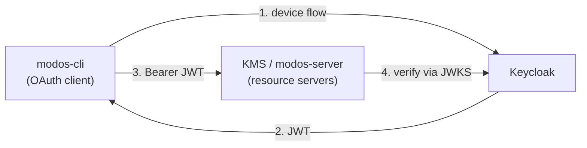
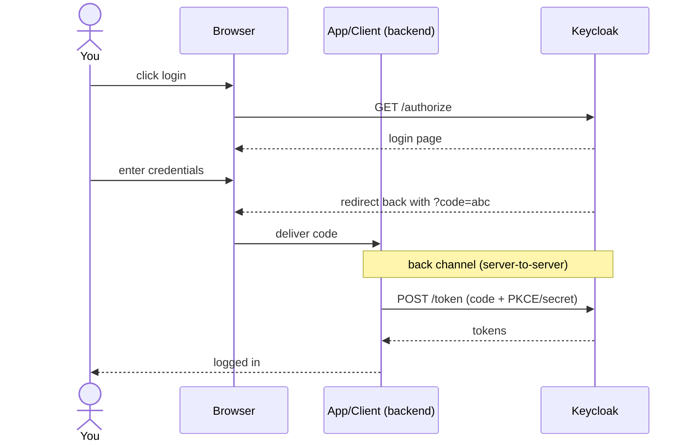
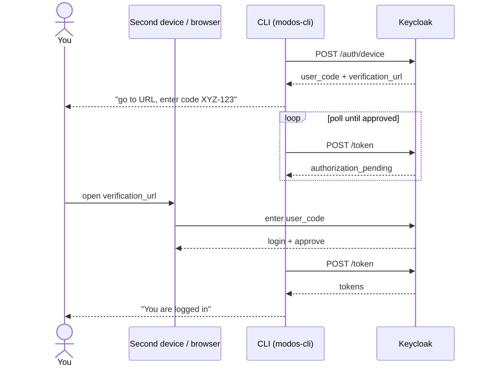

# Test Services

## Start Services

```bash
just services-start
```

> [!NOTE]
>
> `Ctrl+D` to detach from the TUI and `just services-attach` to attach again.

## Keycloak

Keycloak has one realm `modos` where all clients and settings live. The
configuration file for it is located in
`tools/configs/keycloak/modos-realm.conf`.

### Test Users

Keycloak has the following test users:

- Email: `test@mail.ch`, Password: `test`.

### Account UI

Log in under
[http://localhost:8081/realms/modos/account](http://localhost:8081/realms/modos/account)

### Admin UI

Log in under
[http://localhost:8081/admin/master/console/#/modos](http://localhost:8081/admin/master/console/#/modos)
with name `admin` and password `admin`.

### Export Settings

Once you made changes in the UI you can stop keycloak and export the realm
`modos` with.

```bash
just service-keycloak-export
```

### Realm Settings

- Tokens -> Default Signature Algorithm: `ES256`.
- Keys -> Providers -> `eddsa-generated` -> `Ed25519` + Priority: `1000`.

### Client `modos-cli` Settings

#### General

- _Client Authentication_: `off` ← makes it a public client (device flow needs
  no secret; this is what lets KMS verify via JWKS instead of a shared secret)
- _Authorization_: `off`
- _Standard flow_: `off` (the CLI never does a browser redirect)
- _Direct access grants_: `off`
- _Implicit flow_: `off`
- _Service accounts roles_: `off`
- _OAuth 2.0 Device Authorization Grant_: **`on`** ← the device code flow modos
  login uses.

#### Advanced

- Access Token Signature Algorithm: `ES256`.
- ID Token Signature Algorighm: `ES256`.

# OAuth2 / OIDC Flows: Standard vs Device Code

Plain-language explanation of the three login flows relevant to Keycloak, with
diagrams, and why `modos-cli` uses the device code flow.

## In simple terms

**Standard flow (Authorization Code)** — the "normal web login." The app bounces
your **browser** to the IdP login page. After you log in, the IdP sends the
browser back to the app with a short-lived **code**. The app then swaps that
code for the actual tokens on a **back channel** (server-to-server). Tokens
never ride in the browser URL → most secure. Default for web apps; public
clients add PKCE.

**Implicit flow** — a legacy shortcut. Instead of a code, the IdP puts the
**token directly in the browser redirect** (URL fragment). No back-channel
exchange. It existed for old single-page apps before PKCE/CORS were common. The
token is exposed in the browser/URL/history → **deprecated, don't use**.

**Device code flow** — for things with **no browser or no way to receive a
redirect** (a CLI, a TV, an IoT box). The app asks the IdP for a **user code** +
a **verification URL**, tells _you_ to open that URL on _any other device_ and
type the code, and meanwhile **polls** the IdP until you've approved. Then it
gets tokens. This is what `modos-cli` uses — a terminal can't catch a browser
redirect, but it can poll.

The core distinction: standard/implicit need the **same device's browser to
receive a redirect**; device code decouples the browser (any device) from the
app, using polling instead of a redirect.

## Who is the "client"?

In every diagram, **App/Client = the OAuth client**: the program that starts the
login and receives the tokens. It is _not_ the user, and _not_ necessarily a
backend:

- **Confidential client** — keeps a secret, runs on a server → a backend web
  app. (Standard flow.)
- **Public client** — can't hold a secret → a browser SPA, a mobile app, or a
  **CLI**. (Implicit/PKCE/device.)

For MODOS the client is **`modos-cli` on the user's laptop** (public). The
`modos-server` and KMS are **not** the client — they are **resource servers**
that _validate_ the token afterward:



## Standard flow (Authorization Code)



Redirect delivers a **code**; tokens are fetched separately on the back channel.

### "But the token ends up in the browser anyway, right?"

Usually yes — after the exchange the backend gives the browser a **cookie**, and
there are two common patterns:

- **Server-side session (stateful / BFF):** the cookie is just an **opaque
  session id**; the JWT stays in the server's session store. The token itself
  never reaches the browser.
- **Encrypted cookie session (stateless):** the backend puts the token/claims
  **into an encrypted + signed cookie** it hands to the browser. So the token
  _does_ live in the browser — but as ciphertext only the server can read.

## Device code flow (what `modos-cli` uses)



The browser (any device) and the CLI are **separate**; they're linked only by
the short **user code**, and the CLI **polls** instead of receiving a redirect.
